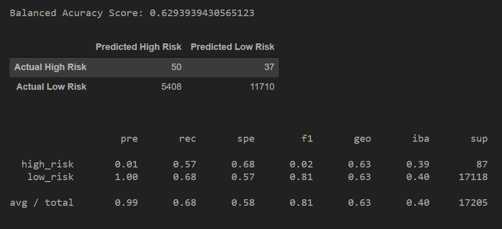
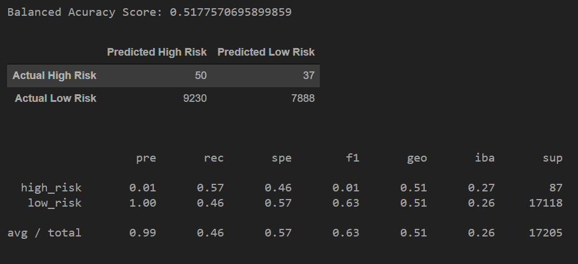
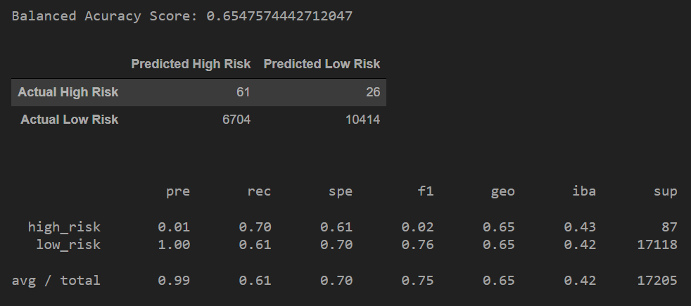
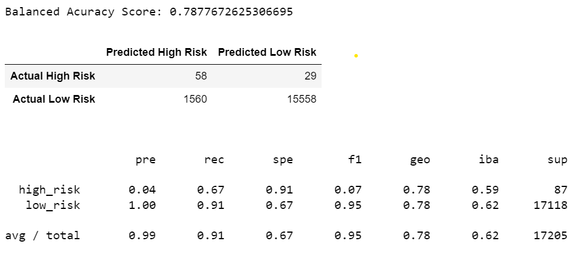
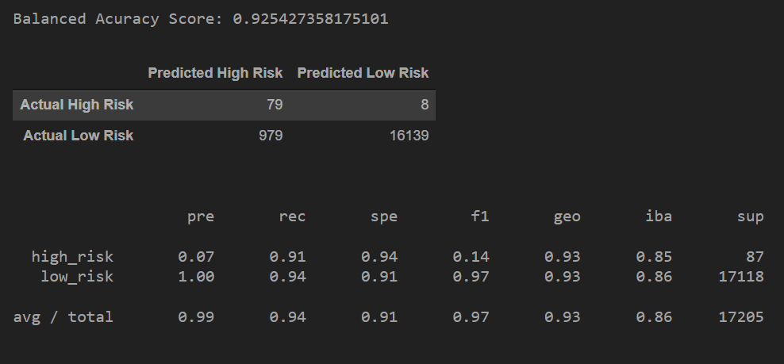

# Credit Risk Analysis

## Overview
This study employs various machine learning models and sampling techniques to predict credit risk.

## Results

### Oversampling

Naive Random Oversampling

- **balanced accuracy score:** (63%) is a metric which measures the model's accuaracy in predicting correct classifications. Balanced accuracy works better for imbalanced datasets. This dataset is imbalanced since the low-risk loans far outweigh the high-risk loans.
- **precision:** Of the predicted high risk loans (50 + 5408), only around 1% (50) were accurate. A low precision score indicates there were a large number of false positives for high-risk loans. Of the predicted low-risk loans (11,710 + 37), almost 100% (11,710) were accurate. A high precision score means 
- **recall score:** (sensitivity) is the ability of the model to find all the positive samples. For all the high-risk loans (50 + 37), this model was able to find 57% (50). For all the low-risk loans (5,408 + 11,710), this model predicted 68% (11,710) of them. A test with high recall means few false negatives, but there may be a high number of false positives. A low recall indicates a large number of false negatives.

SMOTE Oversampling

- **balanced accuracy score:** 63% 
- **precision:** high-risk 1%, low-risk 100%
- **recall score:** high-risk 62%, low-risk 63%

### Undersampling

Undersampling Using Cluster Centroids

- **balanced accuracy score:** 52%
- **precision:** high-risk 1%, low-risk 100%
- **recall score:** high-risk 57%, low-risk 46%

### Combination (Over and Under) Sampling

Combination of Over- and Undersampling: SMOTEENN

- **balanced accuracy score:** 65%
- **precision:** high-risk 1%, low-risk 100%
- **recall score:** high-risk 70%, low-risk 61%

### Ensemble Learners

Balanced Random Forest Classifier

- **balanced accuracy score:** 78%
- **precision:** high-risk 4%, low-risk 100%
- **recall score:** high-risk 67%, low-risk 91%

Easy Ensemble AdaBoost Classifier

- **balanced accuracy score:** 93%
- **precision:** high-risk 7%, low-risk 100%
- **recall score:** high-risk 91%, low-risk 94%

## Summary
On this dataset, the ensemble learners performed better than the undersampling, oversampling, and combination models. I would reccomend using the Easy Ensemble Classifier as it was not bested in any of the metrics, and performed significantly better in most of the categories.

